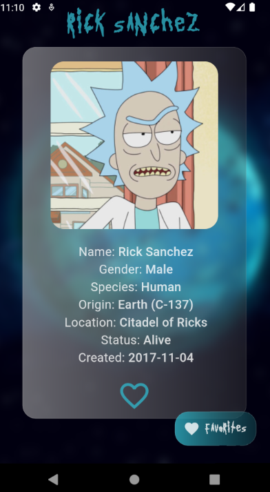
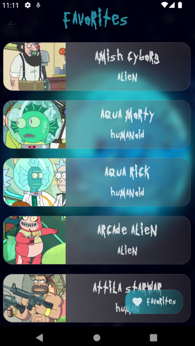

# Rick and Morty 

This Flutter application, named "Rick and Morty ," utilizes the Rick and Morty API to list all characters from the famous "Rick and Morty" series. The app allows users to view specific details for each character and add them to a favorites list, which is locally stored using the Isar database.

## Features

- Infinite scroll list displaying all "Rick and Morty" characters.
- Individual details page for each character.
- Functionality to add characters to the favorites list.
- Local database management using Isar to store the list of favorite characters.

## Packages Used

- dio: For making HTTP requests to the Rick and Morty API.
- flutter_riverpod: For state management and dependency injection.
- go_router: For navigation within the app.
- isar and isar_flutter_libs: For local database management.
- path_provider: For accessing the file system location.

## Installation

1. Add the mentioned dependencies in the `pubspec.yaml` file of your Flutter project.
2. Run `flutter pub get` to fetch the packages.
3. Execute command for changes in CharacterEntity
```
flutter pub run build_runner build
```
## Execution

1. Ensure you have an emulator or physical device connected.
2. Run `flutter run` in the terminal within the project directory.


## Screenshots






## Contributing

If you want to contribute to this application, please follow these steps:

1. Fork the repository.
2. Create a new branch for your changes: `git checkout -b your-branch-name`.
3. Make your changes and commit: `git commit -m "Description of your changes"`.
4. Push your changes to your forked repository: `git push origin your-branch-name`.
5. Create a pull request in the original repository.